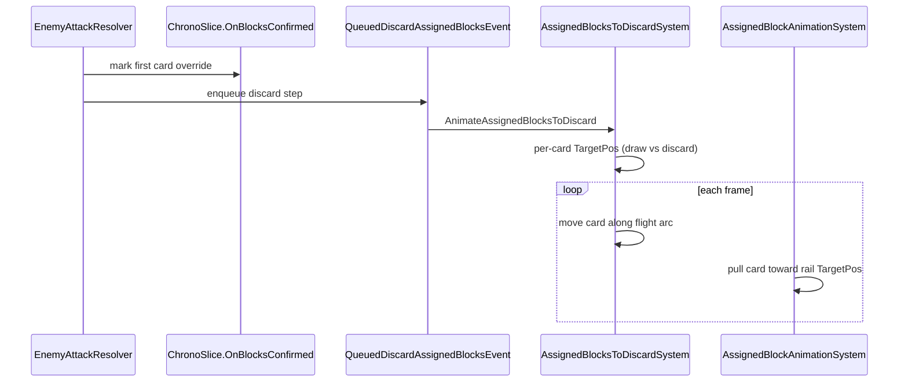

# Fix Chrono Slice multi-block visual destinations

## Problem

Chrono Slice (`[ECS/Objects/Enemies/FrostboundAeon.cs](ECS/Objects/Enemies/FrostboundAeon.cs)`) should send **only the first assigned non-equipment blocker** to the draw pile; all other spent blockers should go to the discard pile.

Current behavior (reported): when multiple cards block, **all** cards visually fly to the draw pile.

## What already works

The rule hook is correct and runs at the right time:

```33:54:ECS/Objects/Enemies/FrostboundAeon.cs
OnBlocksConfirmed = entityManager =>
{
    var firstCard = entityManager.GetEntitiesWithComponent<AssignedBlockCard>()
        .Where(card => !card.GetComponent<AssignedBlockCard>().IsEquipment)
        .OrderBy(card => card.GetComponent<AssignedBlockCard>().AssignedAtTicks)
        .FirstOrDefault();
    // ... adds AssignedBlockDestinationOverride only to firstCard
};
```

`[EnemyAttackResolver](ECS/Scenes/BattleScene/EnemyAttackResolver.cs)` invokes `OnBlocksConfirmed` **before** queuing discard cleanup, so overrides exist before animation starts.

`[AssignedBlockDestinationService](ECS/Services/AssignedBlockDestinationService.cs)` correctly defaults non-overridden blockers to discard.

Existing tests cover:

- override marking on only the earliest card (`[Chrono_slice_marks_earliest_card_and_ignores_earlier_equipment](tests/Crusaders30XX.Tests/FrostboundAeonTests.cs)`)
- immediate (non-animated) 2-blocker zone resolution (`[Immediate_resolution_puts_redirected_card_on_deck_bottom_and_still_grants_resources](tests/Crusaders30XX.Tests/FrostboundAeonTests.cs)`)
- animated single-blocker draw-pile flight (`[Animated_resolution_targets_draw_pile_root_for_redirected_card](tests/Crusaders30XX.Tests/FrostboundAeonTests.cs)`)

**Gap:** no test for **animated** resolution with 2+ blockers.

## Likely root cause

The animated path in `[AssignedBlocksToDiscardSystem](ECS/Scenes/BattleScene/AssignedBlocksToDiscardSystem.cs)` already resolves per-card destination at flight kickoff:

```233:247:ECS/Scenes/BattleScene/AssignedBlocksToDiscardSystem.cs
var destination = AssignedBlockDestinationService.Resolve(card);
Vector2 targetPos = abc.IsEquipment && abc.ReturnTargetPos != Vector2.Zero
    ? abc.ReturnTargetPos
    : ResolvePileTarget(destination);
var flight = new CardToDiscardFlight { TargetPos = targetPos, Destination = destination, ... };
```

However, during `CardToDiscardFlight`, these systems still run and fight the flight motion:


| System                                                                                     | Phase                         | Issue                                                 |
| ------------------------------------------------------------------------------------------ | ----------------------------- | ----------------------------------------------------- |
| `[AssignedBlockAnimationSystem](ECS/Scenes/BattleScene/AssignedBlockAnimationSystem.cs)`   | Presentation (after gameplay) | Keeps `Idle` blockers lerping toward rail `TargetPos` |
| `[AssignedBlockLateLayoutSystem](ECS/Scenes/BattleScene/AssignedBlockLateLayoutSystem.cs)` | LateUpdate                    | Re-applies parallax on top of flight `RenderPos`      |





This conflict was introduced alongside the assigned-block rail refactor (commit `2e3a5d53`) and became user-visible once draw-pile routing was added (commit `9c1c0bb2`).

## Implementation plan

### 1. Add failing regression test (animated, multi-blocker)

Extend `[tests/Crusaders30XX.Tests/FrostboundAeonTests.cs](tests/Crusaders30XX.Tests/FrostboundAeonTests.cs)` with a test like `Animated_resolution_sends_only_first_card_to_draw_pile_and_rest_to_discard`:

- Setup: `SubPhase.EnemyAttack`, deck, two blockers (`assignedAt` 1 and 2), `UI_DrawPileRoot` and `UI_DiscardPileRoot` at distinct positions
- Run `new ChronoSlice().OnBlocksConfirmed(entityManager)` then publish `AnimateAssignedBlocksToDiscard`
- Assert:
  - first card: `CardToDiscardFlight.Destination == DrawPile`, `TargetPos == drawPileRoot`
  - second card: `Destination == DiscardPile`, `TargetPos == discardPileRoot`
- Optionally advance `AssignedBlocksToDiscardSystem` through both flights and assert final `deck.DrawPile` / `deck.DiscardPile` membership

This test is the acceptance criteria for the visual fix.

### 2. Stop rail systems from overriding in-flight blockers

`**[AssignedBlockAnimationSystem](ECS/Scenes/BattleScene/AssignedBlockAnimationSystem.cs)**`

- In `Update`, skip entities that have `CardToDiscardFlight` (entire flight, including pre-start delay)

`**[AssignedBlockLateLayoutSystem](ECS/Scenes/BattleScene/AssignedBlockLateLayoutSystem.cs)**`

- For entities with `CardToDiscardFlight`, set `RenderPos = presentation.CurrentPos` without parallax offset (flight already writes both `CurrentPos` and `RenderPos`)

`**[AssignedBlocksToDiscardSystem.OnDebugCommand](ECS/Scenes/BattleScene/AssignedBlocksToDiscardSystem.cs)**` (defensive)

- When attaching `CardToDiscardFlight`, leave presentation phase alone (do **not** use `Returning`; that triggers hand-return lifecycle). Skipping in animation/layout systems is sufficient.

### 3. Verify per-card destination is captured once at kickoff

No change expected in `[AssignedBlockDestinationService](ECS/Services/AssignedBlockDestinationService.cs)` or ChronoSlice marking logic unless the new test fails on `Destination`/`TargetPos` assignment.

If the test fails before animation conflict fixes, inspect whether `AssignedBlockDestinationOverride` is present on non-first cards at kickoff.

### 4. (Optional, small) Bottom-of-deck rules completeness

Attack text says "bottom of your deck." Consider also adding `MarkedForBottomOfDrawPile` to the redirected card in `ChronoSlice.OnBlocksConfirmed` **only if** existing bottom-insert behavior is implemented elsewhere; current `[CardZoneSystem](ECS/Scenes/BattleScene/CardZoneSystem.cs)` only removes that marker on insert. **Do not expand scope** unless you confirm bottom-insert is already handled; the user's report is visual routing only.

### 5. Verification

- `dotnet test --filter FullyQualifiedName~FrostboundAeonTests`
- `dotnet build` (per repo rules)

## Files to change

- `[ECS/Scenes/BattleScene/AssignedBlockAnimationSystem.cs](ECS/Scenes/BattleScene/AssignedBlockAnimationSystem.cs)` — skip in-flight blockers
- `[ECS/Scenes/BattleScene/AssignedBlockLateLayoutSystem.cs](ECS/Scenes/BattleScene/AssignedBlockLateLayoutSystem.cs)` — skip parallax during flight
- `[tests/Crusaders30XX.Tests/FrostboundAeonTests.cs](tests/Crusaders30XX.Tests/FrostboundAeonTests.cs)` — multi-blocker animated regression test
- Possibly `[ECS/Scenes/BattleScene/AssignedBlocksToDiscardSystem.cs](ECS/Scenes/BattleScene/AssignedBlocksToDiscardSystem.cs)` only if test reveals a kickoff bug

No changes expected to `[ECS/Objects/Enemies/FrostboundAeon.cs](ECS/Objects/Enemies/FrostboundAeon.cs)` unless override marking is proven wrong.