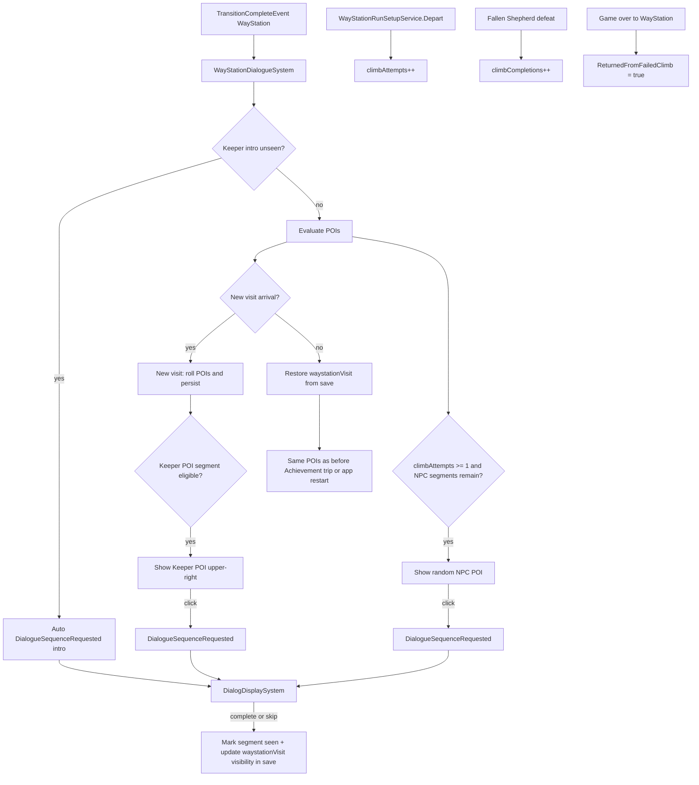

# WayStation Dialogue System

## Goal

When the player first reaches WayStation after the guided tutorial (or `--skip-tutorials`), auto-play **only** Keeper `intro` after the transition wipe completes. All other Keeper dialogue (`early_return` and future segments) uses the upper-right Keeper POI click. Random NPC POIs appear only after the player has Departed at least once (`climbAttempts >= 1`). Progress and climb stats persist in the save file; exhausted characters never reappear.

## Confirmed design decisions (grill session)

| Topic | Decision |
|---|---|
| First visit NPC POI | **No** — Keeper intro only until first Depart |
| Keeper `intro` | Auto-play after `TransitionCompleteEvent` (WayStation visible) |
| Keeper `early_return` + future | **POI click** (upper-right `dialogue-poi.png`), not auto |
| Keeper POI visibility | Shown when `early_return` is eligible (first failed-climb return); click to play |
| `early_return` trigger | Failed/abandoned climb only — **not** Fallen Shepherd victory |
| Keeper + NPC same visit | Both visible when eligible; player engages in any order |
| NPC POI eligibility | `climbAttempts >= 1` and character has remaining segments |
| NPC random pick | Uniform among available NPCs; **new position each visit**; ignored POI does not lock character |
| NPC placement padding | Default **120px**, DebugEditable up to 600px with per-axis clamp |
| Dialogue overlay | Normal dim overlay (not `BackgroundOnly`) |
| Skip button | Marks segment as seen (no replay) |
| `climbAttempts` | Increment on WayStation `Depart()` only |
| `climbCompletions` | Increment on Fallen Shepherd defeat |
| `--skip-tutorials` | Still gets Keeper intro auto (assumed default; not explicitly confirmed) |
| Achievement round-trip | **Restore** saved visit POI state; do **not** re-roll |
| App restart mid-visit | **Restore** saved visit POI state; consumed POIs stay hidden, unconsumed POIs same position |

## Architecture



## 1. Content pipeline

Add to [`Content/Content.mgcb`](Content/Content.mgcb) (same importer/processor block as existing `waystation/climb-poi.png`):

- `waystation/dialogue-poi.png`
- `waystation/the-keeper.png`
- `waystation/elias.png`
- `waystation/old-confessor.png`
- `waystation/mara.png`

## 2. Dialogue data

Extend [`ECS/Data/Dialog/DialogCatalog.cs`](ECS/Data/Dialog/DialogCatalog.cs) with four new definitions using ordered `segments`:

| Definition ID | Segments | Source |
|---|---|---|
| `waystation_keeper` | `intro`, `early_return` | keeper_dialogue.md |
| `waystation_elias` | `dialogue_1`, `dialogue_2`, `dialogue_3` | elias_dialogue.md |
| `waystation_old_confessor` | `dialogue_1` | old_confessor_dialogue.md |
| `waystation_mara` | `dialogue_1` … `dialogue_4` | mara_dialogue.md |

Add a small companion catalog [`ECS/Data/Dialog/WayStationDialogueCatalog.cs`](ECS/Data/Dialog/WayStationDialogueCatalog.cs):

- `KeeperCharacterId`, `EliasCharacterId`, `OldConfessorCharacterId`, `MaraCharacterId` constants
- Ordered segment lists per character
- `NpcCharacterIds` array for random selection
- `TryGetDefinitionId(characterId)` and `TryGetNextSegment(characterId, completedCount)`

Transcribe all lines verbatim from the lore files. Remiel lines in Keeper/Elias/Mara use actor `"Remiel"` (existing `guardian_angel` portrait). Keeper uses `"Keeper"`, Old Confessor `"Old Confessor"`, etc.

## 3. Portraits

Extend `ResolvePortraitAssetName` in [`ECS/Scenes/BattleScene/DialogDisplaySystem.cs`](ECS/Scenes/BattleScene/DialogDisplaySystem.cs):

```csharp
"keeper" => "waystation/the-keeper",
"elias" => "waystation/elias",
"old confessor" => "waystation/old-confessor",
"mara" => "waystation/mara",
```

Add portrait mapping tests in [`tests/Crusaders30XX.Tests/DialogRepositoryTests.cs`](tests/Crusaders30XX.Tests/DialogRepositoryTests.cs).

## 4. Save persistence (bump version 15 → 16)

Add meta fields to [`ECS/Data/Save/SaveFile.cs`](ECS/Data/Save/SaveFile.cs):

```csharp
public int climbAttempts { get; set; }
public int climbCompletions { get; set; }
public Dictionary<string, int> waystationDialogueProgress { get; set; } = new();
public WayStationVisitSave waystationVisit { get; set; } = new();
```

`waystationDialogueProgress` maps character id → count of completed segments (0 = none seen). Segment `N` is complete when progress >= N.

**Per-visit POI layout** (meta, survives app restart):

```csharp
public class WayStationVisitSave
{
    public bool visitInitialized { get; set; }
    public string npcCharacterId { get; set; } = string.Empty;
    public float npcScreenX { get; set; }
    public float npcScreenY { get; set; }
    public bool npcPoiVisible { get; set; }
    public bool keeperPoiVisible { get; set; }
    /// <summary>Segment id this visit's Keeper POI plays on click (e.g. early_return).</summary>
    public string keeperPoiSegmentId { get; set; } = string.Empty;
}
```

Add helpers in [`ECS/Data/Save/SaveCache.cs`](ECS/Data/Save/SaveCache.cs):

- `GetWayStationDialogueProgress(characterId)` / `MarkWayStationDialogueSegmentSeen(characterId)` (increments count, persists)
- `GetWayStationVisit()` / `SaveWayStationVisit(WayStationVisitSave)` / `ResetWayStationVisit()` (clear + persist)
- On POI consume: set `npcPoiVisible` or `keeperPoiVisible` false and persist immediately
- `IncrementClimbAttempts()` — call from [`ECS/Services/WayStationRunSetupService.cs`](ECS/Services/WayStationRunSetupService.cs) `Depart()`
- `IncrementClimbCompletions()` — call from [`ECS/Scenes/BattleScene/EnemyDefeatFlowSystem.cs`](ECS/Scenes/BattleScene/EnemyDefeatFlowSystem.cs) on `EnemyId.FallenShepherd` defeat (before `EndRunOnLoad` transition)

Preserve new fields in `CreateFreshRunPreservingMeta` and `CreateInactiveSavePreservingMeta` (same pattern as `guidedTutorialCompleted` / `achievements`).

## 5. Keeper dialogue selection (code-driven)

Add read-only [`ECS/Services/WayStationDialogueService.cs`](ECS/Services/WayStationDialogueService.cs):

```csharp
// Only intro auto-plays; returns null if intro already seen
string TryGetKeeperAutoSegment();

// Segment available via Keeper POI click, or null
string TryGetKeeperPoiSegment(bool returnedFromFailedClimb);

bool HasRemainingNpcDialogue();
bool IsNpcPoiEligible(); // climbAttempts >= 1 && HasRemainingNpcDialogue()
string PickRandomNpcCharacterId(); // uniform among NPCs with remaining segments
```

**Baseline Keeper rules:**

| Segment | Delivery | Eligibility |
|---|---|---|
| `intro` | **Auto** after `TransitionCompleteEvent` | `waystationDialogueProgress["keeper"] == 0` |
| `early_return` | **Keeper POI click** | Intro seen, `early_return` unseen, `ReturnedFromFailedClimb` flag set on this arrival |
| Future segments | **Keeper POI click** | Defined in code using `climbAttempts`, `climbCompletions`, progress |

`TryGetKeeperAutoSegment()` returns only `intro`. `TryGetKeeperPoiSegment()` handles `early_return` and all future segments.

Future keeper segments: add cases to `TryGetKeeperPoiSegment` only (not auto).

## 5b. Visit-scoped POI state (saved to disk)

A **WayStation visit** is the current hub POI layout. Rolled once per visit, **persisted in `SaveFile.waystationVisit`**, and restored on Achievement round-trips **and app restarts**.

**New visit** (call `ResetWayStationVisit()`, re-roll, persist):

- Return from climb (failed, abandoned, or Fallen Shepherd victory)
- First arrival after tutorial / skip-tutorials once Keeper `intro` completes (initializes visit; NPC POI only if `climbAttempts >= 1`)

**Same visit** (restore `waystationVisit` from save; no re-roll):

- WayStation → Achievement → WayStation
- App quit/relaunch while `visitInitialized == true` and player returns to WayStation without a new-visit arrival

**Persist on every change:** roll, POI visibility toggle, dialogue complete/skip.

**Restart behavior examples:**

| State before quit | After relaunch |
|---|---|
| Keeper POI + NPC POI both visible, neither played | Both visible; NPC at same `(npcScreenX, npcScreenY)` |
| Keeper dialogue completed this visit | Keeper POI hidden; NPC POI still visible at same position if not played |
| NPC dialogue completed this visit | NPC POI hidden; Keeper POI still visible if not played |
| Both consumed this visit | Neither POI visible until next visit (climb return) |

`keeperPoiSegmentId` is saved when the Keeper POI is rolled (e.g. `early_return`) so click-to-play still works after restart without the transient `ReturnedFromFailedClimb` flag.

`WayStationDialogueSystem` on WayStation load:

- If **new-visit arrival** → `ResetWayStationVisit()`, evaluate eligibility, roll NPC + position, set keeper/npc visibility flags, `visitInitialized = true`, persist
- Else if `visitInitialized` → restore POIs from `SaveCache.GetWayStationVisit()`
- Else → first-time setup (intro visit before any POI roll)

## 6. New system: `WayStationDialogueSystem`

Create [`ECS/Scenes/WayStationScene/WayStationDialogueSystem.cs`](ECS/Scenes/WayStationScene/WayStationDialogueSystem.cs) with `[DebugTab("WayStation Dialogue")]`.

**Responsibilities:**

- Subscribe to `TransitionCompleteEvent` (WayStation), `LoadSceneEvent` (visit restore vs new visit), `DialogueSequenceCompleted`
- On `TransitionCompleteEvent`: if `TryGetKeeperAutoSegment()` → publish `DialogueSequenceRequested` for `intro`
- On load after transition:
  - **New-visit arrival** (climb return, etc.): roll POIs, write `waystationVisit`, persist
  - **Same visit** (Achievement back, app restart with `visitInitialized`): restore from `waystationVisit`
  - Show **Keeper POI** when `keeperPoiVisible` (restore) or newly eligible
  - Show **NPC POI** when `npcPoiVisible` (restore) or newly eligible
- Manage POI entities (screen-space, **not** map world coords):
  - **Keeper POI** — `dialogue-poi.png`, fixed upper-right; `[DebugEditable]` `KeeperPoiScreenX/Y`, `KeeperPoiIconSize`, `KeeperPoiHoverScale`
  - **NPC POI** — same icon, one per visit; random position inside padded safe zone
- `[DebugEditable]` `NpcPoiPaddingPx` (default **120**, max 600) — clamp per axis: `Math.Min(padding, (dimension - minZoneSize) / 2)`
- Hide POIs while climb modal open or dialogue active
- Click Keeper/NPC POI → publish `DialogueSequenceRequested` for pending segment
- On `DialogueSequenceCompleted` **or skip** → `MarkWayStationDialogueSegmentSeen`, set `keeperPoiVisible` or `npcPoiVisible` false in `waystationVisit`, persist immediately
- Both POIs can be visible and engaged independently in any order

**Entity pattern** (per AGENTS.md): `Transform` + `UIElement` entities `WayStation_POI_KeeperDialogue`, `WayStation_POI_NpcDialogue` with `POITitleTooltipSource` (character display name).

Register in [`Game1.cs`](Game1.cs): construct, `AddSystem`, draw in `SceneId.WayStation` case after `WayStationPoiDisplaySystem.Draw`.

Update [`ECS/Scenes/WayStationScene/WayStationSceneConstants.cs`](ECS/Scenes/WayStationScene/WayStationSceneConstants.cs) with new entity names.

## 7. Arrival context for climb return

Add transient flag (not saved), e.g. `WayStationArrivalContext.ReturnedFromFailedClimb`:

- Set `true` in [`GameOverOverlayDisplaySystem`](ECS/Scenes/BattleScene/GameOverOverlayDisplaySystem.cs) before `ShowTransition` to WayStation
- Consumed by `WayStationDialogueSystem` when evaluating `TryGetKeeperPoiSegment` for `early_return`, then cleared
- **Not** set on Fallen Shepherd victory, Achievement back, or title-menu routing

## 8. Visit flow summary

| Visit | Keeper | Random NPC POI |
|---|---|---|
| First (post-tutorial / skip-tutorials) | Auto `intro` after transition | **None** (no Depart yet) |
| After first Depart, no failed return yet | — | 1 random NPC if segments remain |
| First failed-climb return | Keeper POI → click `early_return` | 1 random NPC (can coexist; any order) |
| Later visits | Keeper POI when code rules match | 1 random NPC if `climbAttempts >= 1` and segments remain |
| Achievement → WayStation back | **Restore from save** | **Restore from save** |
| App restart mid-visit | **Restore from save** (consumed POIs stay hidden) | **Restore from save** (same position) |
| Character exhausted | — | Excluded from random pool on **next** visit roll |

NPC and Keeper POIs can coexist on a visit once eligible.

## 9. Tests

Add [`tests/Crusaders30XX.Tests/WayStationDialogueTests.cs`](tests/Crusaders30XX.Tests/WayStationDialogueTests.cs):

- Segment ordering and exhaustion (progress 3 → Elias has no next segment)
- `PickRandomNpcCharacterId` only returns characters with remaining dialogue
- Keeper `intro` auto only; `early_return` POI gating with `ReturnedFromFailedClimb`
- NPC POI not shown when `climbAttempts == 0`
- Achievement round-trip restores `waystationVisit` without re-roll
- App restart restores `waystationVisit`; partial consumption persists correctly
- Save round-trip for `waystationVisit`, `waystationDialogueProgress`, `climbAttempts`, `climbCompletions`
- Skip marks segment seen
- Dialog catalog ASCII-only line validation for new segments

## 10. Snapshot fixture

Update [`ECS/Diagnostics/Snapshots/Fixtures/WayStationSnapshotFixture.cs`](ECS/Diagnostics/Snapshots/Fixtures/WayStationSnapshotFixture.cs) to register `WayStationDialogueSystem` so `dotnet run -- snapshot waystation` includes dialogue POIs.

## 11. Build verification

Run `dotnet build` and fix any compile errors.

## Key files touched

- New: `WayStationDialogueSystem.cs`, `WayStationDialogueCatalog.cs`, `WayStationDialogueService.cs`, `WayStationDialogueTests.cs`
- Modified: `DialogCatalog.cs`, `DialogDisplaySystem.cs`, `SaveFile.cs`, `SaveCache.cs`, `WayStationRunSetupService.cs`, `EnemyDefeatFlowSystem.cs`, `GameOverOverlayDisplaySystem.cs`, `Game1.cs`, `Content.mgcb`, `WayStationSceneConstants.cs`, `WayStationSnapshotFixture.cs`, `DialogRepositoryTests.cs`
